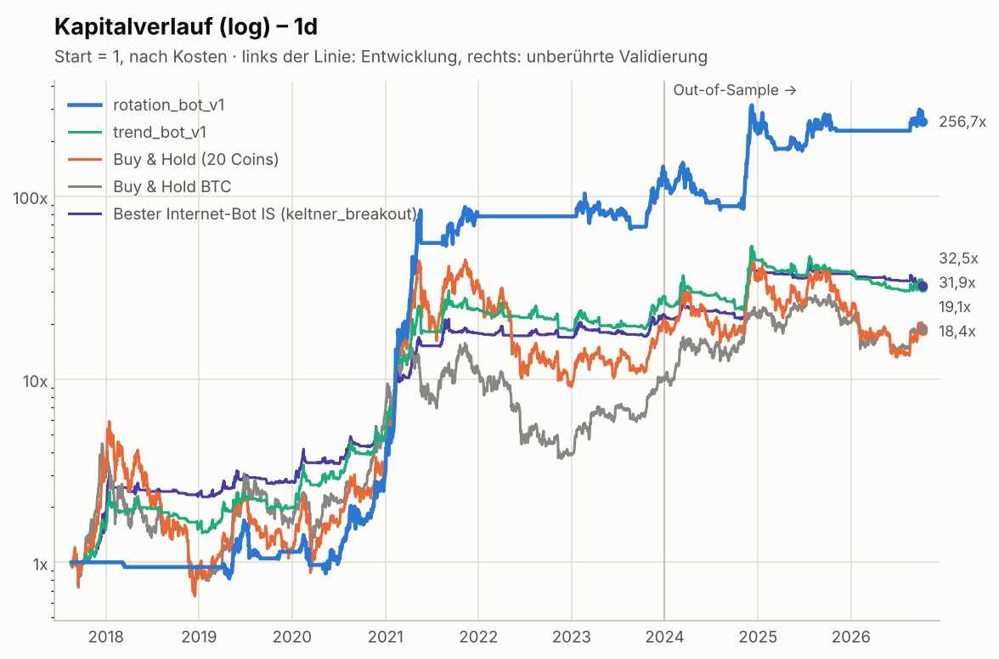

# Trading-Bot-V1.0

Ein von Grund auf gebauter **Krypto-Trading-Bot** (Python) und ein Testlabor, in dem
**53 bekannte Trading- und Vorhersage-Bots aus dem Internet** unter identischen, realistischen
Bedingungen gegeneinander antreten. Freqtrade, Gekko, Zenbot, Jesse, TradingView, 3Commas-DCA,
Pionex-Grid, LSTM, Random Forest, FreqAI und weitere. Die Erkenntnisse daraus sind in die
eigenen Bots `rotation_bot_v1` und `trend_bot_v1` eingeflossen.

> ⚠️ **Keine Anlageberatung.** Krypto-Handel kann zum Totalverlust führen. Alle Ergebnisse sind
> Backtests; vergangene Ergebnisse garantieren keine zukünftigen. Starte mit Paper-Trading.

**👉 Schritt-für-Schritt-Anleitung zur Nutzung: [ANLEITUNG.md](ANLEITUNG.md)**

## Ergebnis auf einen Blick

Validierung auf **unberührten Daten (Jan. 2024 – Okt. 2026)**, Tageskerzen, nach Kosten
(0,1 % Gebühr + 0,05 % Slippage pro Order):

| Bot | Rendite p.a. | Sharpe | Max. Drawdown |
|---|---|---|---|
| **`rotation_bot_v1`** – eigener Portfolio-Bot (20 Coins) | **+28,9 %** | **0,77** | **−44,7 %** |
| `trend_bot_v1` – eigener Einzel-Coin-Bot (auf 20 Coins verteilt) | +5,6 % | 0,33 | −43,4 % |
| Bester Internet-Bot in diesem Zeitraum (`bollinger_breakout`) | +17,0 % | 0,70 | −32,8 % |
| Buy & Hold, 20 Coins gleich gewichtet | −3,7 % | 0,26 | −71,8 % |
| Buy & Hold, nur Bitcoin | +26,8 % | 0,74 | −53,0 % |



**Die wichtigsten Erkenntnisse aus rund 9.500 Backtests** (Details in [reports/ERGEBNISSE.md](reports/ERGEBNISSE.md)):

* Nur **Trend- und Ausbruchsregeln auf Tages- und 4h-Kerzen** schlagen Buy & Hold risikobereinigt. Auf 1h schaffen das nur 3 von 52 Bots.
* **Gebühren** zerstören fast jeden Bot, der viel handelt. Der AR-Prognose-Bot fällt auf 1h von Sharpe +1,64 (ohne Kosten) auf −7,05 (mit 0,1 % Gebühr).
* **ML-Vorhersage-Bots** (LSTM, Random Forest, FreqAI …) treffen die Richtung der nächsten Kerze kaum besser als ein Münzwurf. Wunder-Backtests im Netz entstehen oft durch Look-ahead-Fehler; ein absichtlich fehlerhafter Tutorial-Bot zeigt das.
* **Hohe Trefferquoten täuschen.** Freqtrade-Scalper gewinnen 80–89 % ihrer Trades und verlieren trotzdem bis zu 53 % pro Jahr.
* **„Dem besten Bot folgen“** funktioniert nicht; vergangene Gewinner sind keine künftigen.
* Was wirkt, ist **Risikosteuerung**: Marktfilter (Bitcoin-Trend), Trendfilter, Volatilitätsgewichtung und wenig Handel.

## Die eigenen Bots

### `rotation_bot_v1` – Dual-Momentum-Rotation (empfohlen)

Einmal pro Woche:

1. Alle Coins werden nach ihrer Rendite über **14, 30 und 60 Tage** gerankt.
2. Infrage kommen nur Coins mit positivem Momentum, die über ihrer **100-Tage-Linie** liegen.
3. Der Bot hält die **5 stärksten**, gewichtet nach umgekehrter Volatilität, höchstens 35 % je Coin.
4. Liegt **Bitcoin unter seiner 200-Tage-Linie**, geht der Bot komplett in Cash.

### `trend_bot_v1` – Mehrheitsentscheid von 8 Top-Regeln des Benchmarks (für einzelne Coins)

Acht Regeln aus den Top 12 des Benchmarks stimmen ab, bewusst verschiedene Regeltypen:

* EMA 12/26 und SMA 10/20
* Donchian 20/10 und 30-Tage-Momentum
* Supertrend
* Keltner- und Bollinger-Ausbruch
* Ichimoku

Melden mindestens 5 von 8 einen Aufwärtstrend, ist der Bot investiert. In der Validierung hat er
deutlich nachgelassen (Gewinner-Fluch, siehe Bericht).

### Wie die Bots entstanden sind

1. **Recherche:** populäre Open-Source-Bots und Community-Strategien, siehe [Katalog](reports/STRATEGIEN.md).
2. **Nachbau** aller 53 Bots von Grund auf; Indikatoren rechnen identisch mit TA-Lib.
3. **Benchmark:** jeder Bot auf 20 Coins × 1d/4h/1h. Alle Designentscheidungen fielen nur auf Daten bis Ende 2023.
4. **Eigener Bot:** 43 Varianten, Auswahl nach einer vorher festgelegten Regel.
5. **Validierung:** ein einziger Test auf 2024–2026 sowie Survivorship-Stresstest und Deflated Sharpe Ratio.

## Installation

```bash
git clone <repo-url> && cd Trading-Bot-V1.0
python3 -m venv .venv && source .venv/bin/activate
pip install -r requirements.txt
# optional: LSTM-Bot (PyTorch, CPU reicht)
pip install torch --index-url https://download.pytorch.org/whl/cpu
```

Auf Ubuntu/Debian geht es auch in einem Rutsch: `bash scripts/install_ubuntu.sh` installiert und testet alles (siehe [ANLEITUNG.md](ANLEITUNG.md)).

Python ≥ 3.10. Marktdaten kommen von Binances öffentlicher API (kein API-Key nötig) und werden in `data/cache/` zwischengespeichert.

## Benutzung

```bash
# 1) Daten laden (20 Coins × 1d/4h/1h, ~45 MB, ca. 10 Minuten)
python -m trading_bot fetch

# 2) Alle Bots auflisten (Familie, Original-Zeitebene, Quelle)
python -m trading_bot list

# 3) Den eigenen Portfolio-Bot testen (inkl. aktueller Zielgewichte)
python -m trading_bot portfolio --strategy rotation_bot_v1 --interval 1d

# 4) Einen Einzel-Coin-Bot testen – mit Vergleich zu Buy & Hold
python -m trading_bot backtest --strategy trend_bot_v1 --symbol BTCUSDT --interval 1d
python -m trading_bot backtest --strategy ft_supertrend --symbol ETHUSDT --interval 1h --trades 10

# 5) Den kompletten Benchmark wiederholen (alle Bots × alle Coins × alle Zeitebenen, ~25 Min. mit 4 Kernen)
python -m trading_bot benchmark --jobs 4 --tag meinlauf
python -m trading_bot report --tag meinlauf      # -> reports/meinlauf_rankings.md

# 6) Paper-Trading (Standard: kein echtes Geld, Zustand in state/)
python -m trading_bot paper --strategy rotation_bot_v1 --interval 1d          # alle handelbaren Coins
python -m trading_bot paper --strategy rotation_bot_v1 --interval 1d --once   # nur ein Entscheidungsschritt
python -m trading_bot paper --strategy trend_bot_v1 --symbols BTCUSDT ETHUSDT --interval 4h
python -m trading_bot status                                                  # Kontostand des Paper-Kontos

# 7) Live-Trading (echte Orders über ccxt, nur bewusst einschalten!)
pip install ccxt
export TB_API_KEY=... TB_API_SECRET=...
python -m trading_bot paper --live --i-understand-the-risks --strategy rotation_bot_v1 --interval 1d \
    --quote USDC --max-capital 500      # EU: USDC-Paare; höchstens 500 USDC verwalten
```

Kosten lassen sich global setzen, z. B. `python -m trading_bot --fee 0.00075 --slippage 0.0002 backtest ...`.

## Projektstruktur

```
trading_bot/
  data.py            Binance-Download, Cache, synthetische Testdaten
  indicators.py      30+ Indikatoren von Grund auf (numerisch identisch mit TA-Lib)
  backtest.py        Event-Engine: Ausführung zur nächsten Eröffnung, Gebühren, Slippage,
                     Stop-Loss/Trailing/ROI-Tabellen (Freqtrade-Semantik), ATR-Stops
  portfolio.py       Portfolio-Engine: ein Konto, Kapital zwischen Coins verteilt, Delistings
  portfolio_strategies.py  Momentum-Rotation, rotation_bot_v1, Referenzen
  metrics.py         CAGR, Sharpe, Sortino, Drawdown, Calmar, PSR, Deflated Sharpe
  strategies/
    classic.py       Klassiker (Gekko, Zenbot, Jesse, backtrader, Turtle, Connors …)
    freqtrade.py     17 Ports aus freqtrade-strategies + offizielles Sample-Template
    tradingview.py   UT Bot, Squeeze Momentum, WaveTrend, Chandelier Exit
    bots.py          DCA-Bot (3Commas-Stil) und Grid-Bot (Pionex-Stil)
    ml.py            Vorhersage-Bots: LogReg, Random Forest, FreqAI-LightGBM, LSTM,
                     Lorentzian-kNN, AR-Prognose (+ absichtlich fehlerhafte Tutorial-Demo)
    ensemble.py      Der eigene Bot (TrendEnsemble, MetaSelector, Versionen v0.x–v1)
  research/
    benchmark.py     Parallel-Benchmark, In-/Out-of-Sample, Portfolio-Aggregation
    report.py        Grafiken und Ranglisten
    final_report.py  Abbildungen und Signifikanz für reports/ERGEBNISSE.md
    tables.py        Tabellen für den Ergebnisbericht
  live.py            Paper-Broker, ccxt-Broker, Bot-Runner und Portfolio-Runner (nutzen dieselbe Engine)
  cli.py             Kommandozeile
tests/               Look-ahead-Detektor für jede Strategie, Engine-, Indikator-, Live-Tests
reports/             ERGEBNISSE.md (Bericht), ANHANG_RANGLISTEN.md, STRATEGIEN.md, Grafiken, Tabellen
```

## Tests

```bash
python -m pytest -q
```

Der wichtigste Test ist `tests/test_causality.py`: Er lässt **jede** registrierte Strategie einmal auf
abgeschnittenen und einmal auf vollständigen Daten laufen. Ändert sich durch zusätzliche Zukunftsdaten
auch nur ein Cent der Vergangenheit, hat die Strategie Look-ahead-Bias – genau der Fehler, der viele
im Internet gezeigte Bots unrealistisch gut aussehen lässt. Die absichtlich fehlerhafte
Tutorial-Demo (`demo_leaky_tutorial_rf`) wird von diesem Test zuverlässig erwischt.

## Methodik: warum diese Zahlen belastbarer sind als typische Bot-Werbung

| Problem bei vielen Online-Bots | So wird es hier verhindert |
|---|---|
| Handel zum Schlusskurs, der das Signal erst erzeugt hat | Entscheidung auf dem Schlusskurs von Kerze *t*, Ausführung zur **Eröffnung von *t+1*** |
| Gebühren/Slippage ignoriert | **0,10 % Gebühr + 0,05 % Slippage pro Order** (≈ 0,3 % pro Roundtrip, Binance-Spot-Niveau) |
| Optimistische Intrabar-Annahmen | Stop vor Take-Profit, wenn beides in einer Kerze möglich ist; Gaps werden zum Eröffnungskurs gefüllt; Trailing-Stops nur mit Hochs aus **vorherigen** Kerzen |
| Look-ahead-Bias (z. B. globales Min/Max-Scaling, `shift(-1)`) | Automatischer **Kausalitätstest für jede Strategie** (abgeschnittene vs. volle Daten müssen identische Vergangenheit liefern) |
| ML-Modell auf Daten trainiert, die es später „vorhersagt“ | Strikt **walk-forward**, Labels mit Zukunftsbezug werden aus dem Trainingsfenster entfernt (Purging), Skalierung nur auf dem Trainingsfenster |
| Cherry-Picking eines Coins | **20 Coins**, darunter Absteiger und delistete Coins (EOS, MATIC, WAVES), Auswertung als gleichgewichtetes Portfolio |
| Cherry-Picking einer Zeitebene | Jeder Bot auf **1d, 4h und 1h**; die 5m-Scalper zusätzlich auf 5m |
| Parameter auf die gesamte Historie optimiert | Alle Designentscheidungen nur auf **In-Sample-Daten (2017-08 bis 2023-12)**; die **Out-of-Sample-Periode (2024-01 bis 2026-10)** wurde erst ganz am Ende einmal ausgewertet |
| „Bester von 100 Versuchen“ wird als Können verkauft | **Deflated Sharpe Ratio**: korrigiert die Sharpe Ratio um die Anzahl getesteter Varianten |
| Indikatoren weichen vom Original ab | Indikatoren sind gegen **TA-Lib** getestet (identisch bis auf Rundungsfehler), damit die Freqtrade-Ports wie die Originale rechnen |

## Grenzen (ehrlich)

* **Survivorship-Bias ist reduziert, nicht beseitigt:** Die Coin-Liste ist aus heutiger Sicht gewählt, auch wenn bewusst Verlierer und delistete Coins enthalten sind. Ohne die späteren Gewinner (nur Coins, die vor 2019 gelistet waren) sinkt die In-Sample-Sharpe von `rotation_bot_v1` von 1,59 auf 1,14; out-of-sample bleibt sie bei 0,69.
* **Klumpenrisiko 2021:** Ein großer Teil der In-Sample-Rendite des Rotation-Bots stammt aus der Altcoin-Saison 2021. 2024 hinkte er Bitcoin deutlich hinterher.
* **Nur Spot, nur Long:** Keine Hebel, keine Short-Positionen, keine Funding-Kosten, keine Steuern.
* **Pauschales Slippage-Modell:** Bei kleinen Coins oder großen Beträgen ist die reale Slippage höher.
* **Freqtrade-Feinheiten** (Order-Timeouts, `max_open_trades`, Protections) sind nicht nachgebaut; Einstiege, Ausstiege, ROI-Tabellen, Stop-Loss und Trailing-Stops schon.
* **Stops im Live-Betrieb** werden zum Kerzenschluss geprüft, nicht tickgenau.
* **Vergangene Ergebnisse garantieren keine zukünftigen.** Auch ein sauber getesteter Bot kann in einem neuen Marktregime versagen.
