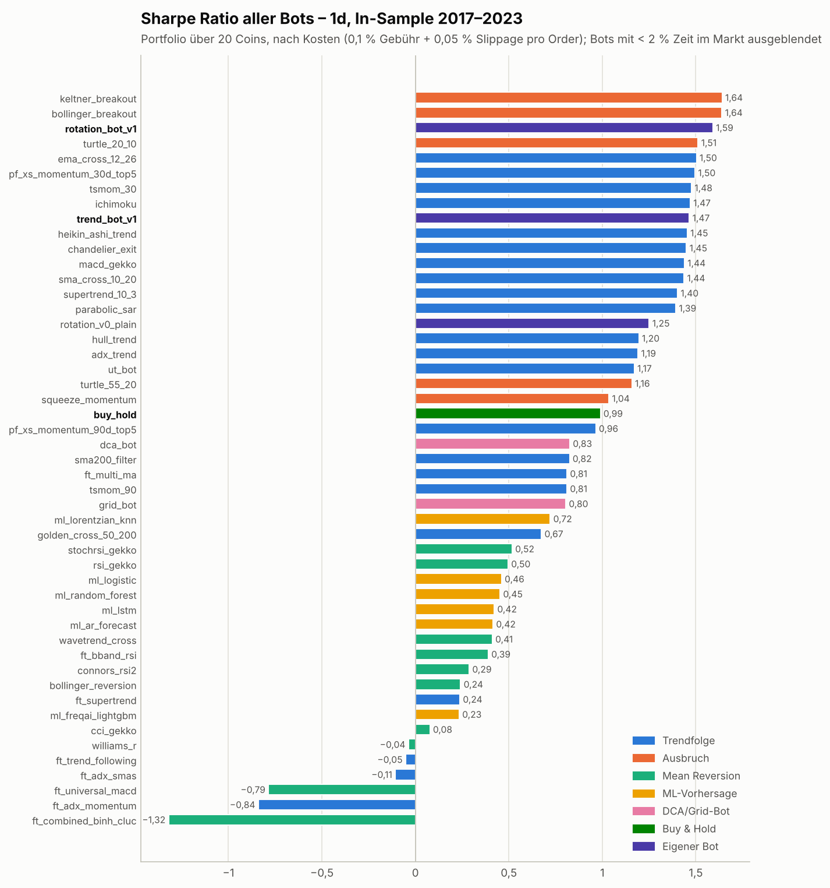
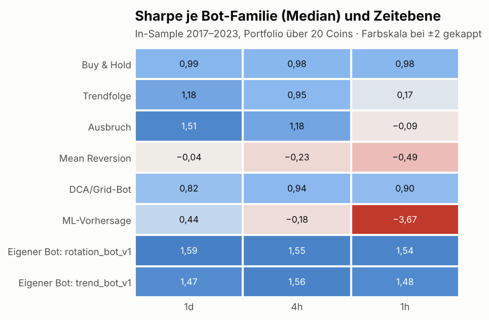
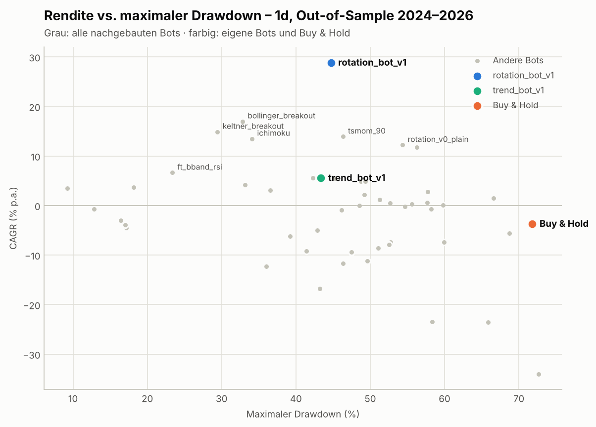
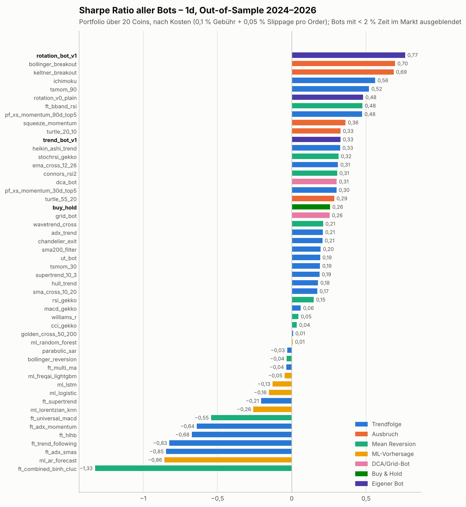

# Ergebnisse: 53 Internet-Bots im fairen Vergleich – und was der eigene Bot daraus gelernt hat

*Stand: 9. Oktober 2026 · Daten: Binance Spot, 20 Coins, Aug. 2017 bis Okt. 2026 · Kosten: 0,10 % Gebühr + 0,05 % Slippage pro Order · alle Zahlen nach Kosten*

## Kurzfassung

* **53 bekannte Trading- und Vorhersage-Bots** aus dem Internet wurden von Grund auf nachgebaut. Dazu gehören 17 Freqtrade-Community-Strategien, Klassiker aus Gekko, Zenbot, Jesse und dem Turtle-System, TradingView-Skripte, ein 3Commas-artiger DCA-Bot, ein Pionex-artiger Grid-Bot und 6 ML-Vorhersage-Bots (LSTM, Random Forest, FreqAI-LightGBM, Lorentzian-kNN, logistische Regression, AR-Prognose). Sie liefen unter **identischen, realistischen Bedingungen** auf 20 Coins × 3 Zeitebenen, insgesamt rund **9.500 Backtests**.
* **Was funktioniert:** Ausbruchs- und Trendfolge-Regeln auf **Tages- und 4h-Kerzen** mit Rückblick von **1–4 Wochen**. **Was nicht funktioniert:** Mean Reversion, die meisten Freqtrade-Scalper und alle ML-Bots, die die nächste Kerze vorhersagen. Bei ihnen frisst vor allem die **Gebühr** jeden Vorteil auf: Auf 1h schlagen nur 3 von 52 Bots Buy & Hold.
* **Eigener Bot `rotation_bot_v1`** (Portfolio über 20 Coins), in der **unberührten Validierung 2024–2026**:
  * Er ist dort auf allen drei Zeitebenen **der beste aller getesteten Bots**, die nennenswert investiert waren: **+29 % p.a., Sharpe 0,76, max. Drawdown −45 %**.
  * Buy & Hold der 20 Coins kommt im selben Zeitraum auf −4 % p.a., Sharpe 0,26 und −72 %.
  * Nur Bitcoin halten bringt +27 % p.a., Sharpe 0,74 und −53 %.
* **Eigener Bot `trend_bot_v1`** (je Coin) war In-Sample stark (Sharpe 1,47–1,56) und hat Out-of-Sample deutlich nachgelassen (Sharpe 0,33–0,52). Er schlägt Buy & Hold weiterhin, aber nicht die besten Einzelregeln. Das ist der klassische **Gewinner-Fluch**, und er wird hier offen berichtet.
* **Ehrliche Statistik:** Nach 2¾ Jahren Out-of-Sample liegt die Wahrscheinlichkeit, dass die wahre Sharpe von `rotation_bot_v1` über 0 liegt, bei **≈ 90 %**. Das ist gut, aber kein Beweis. Korrigiert man um *alle* rund 95 betrachteten Strategien, ist der In-Sample-Vorsprung allein **nicht** signifikant (Deflated Sharpe ≈ 0,2). Erst die bestandene OOS-Prüfung macht das Ergebnis glaubwürdig. Paper-Trading ist der nächste Schritt, nicht Echtgeld.

## 1. Testaufbau

| | |
|---|---|
| **Märkte** | 20 USDT-Paare auf Binance: BTC, ETH, BNB, XRP, ADA, SOL, DOGE, LTC, LINK, TRX, XLM, ETC, EOS, NEO, IOTA, AVAX, BCH, DOT, MATIC, WAVES. Bewusst inklusive Absteigern und **delisteten** Coins (EOS 2025, MATIC 2024, WAVES 2024) |
| **Zeitebenen** | 1d, 4h, 1h (≈ 1,3 Mio. Kerzen); zusätzlich 5m für die Scalper (6 Coins, 2023–2026) |
| **Perioden** | **In-Sample** 2017-08 bis 2023-12 (alle Designentscheidungen) · **Out-of-Sample** 2024-01 bis 2026-10 (einmalige Validierung) |
| **Ausführung** | Signal auf dem Schlusskurs, Order zur **Eröffnung der nächsten Kerze**; Stops und Take-Profits intrabar, pessimistisch |
| **Kosten** | 0,10 % Gebühr + 0,05 % Slippage pro Order (≈ 0,3 % pro Roundtrip) |
| **Bewertung** | Gleichgewichtetes Portfolio aller Coins (täglich rebalanciert); Kennzahlen auf Tagesbasis: CAGR, Sharpe, Sortino, max. Drawdown, Calmar, PSR/DSR |
| **Kontrollen** | Look-ahead-Test für jede Strategie · Indikatoren gegen TA-Lib verifiziert · ML strikt walk-forward mit Purging |

## 2. Rangliste der Internet-Bots (In-Sample 2017–2023)

Top 10 und Schlusslichter je Zeitebene. Bots mit < 2 % Zeit im Markt sind ausgeblendet. Die vollständigen Ranglisten stehen in [ANHANG_RANGLISTEN.md](ANHANG_RANGLISTEN.md).

**1d** – Buy & Hold: Sharpe 0,99, CAGR +60,7 %, Max. DD −88,9 %

| Rang | Bot | Familie | Sharpe | CAGR | Max. DD | Trades/Jahr je Coin |
|---|---|---|---|---|---|---|
| 1 | `keltner_breakout` | Ausbruch | 1,64 | +62,6 % | −27,1 % | 4 |
| 2 | `bollinger_breakout` | Ausbruch | 1,64 | +76,1 % | −40,1 % | 7 |
| 3 | `turtle_20_10` | Ausbruch | 1,51 | +73,8 % | −46,8 % | 5 |
| 4 | `ema_cross_12_26` | Trendfolge | 1,50 | +91,8 % | −55,3 % | 6 |
| 5 | `tsmom_30` | Trendfolge | 1,48 | +88,9 % | −66,7 % | 13 |
| 6 | `ichimoku` | Trendfolge | 1,47 | +62,6 % | −40,0 % | 5 |
| 7 | `heikin_ashi_trend` | Trendfolge | 1,45 | +61,0 % | −41,3 % | 17 |
| 8 | `chandelier_exit` | Trendfolge | 1,45 | +82,1 % | −62,8 % | 5 |
| 9 | `macd_gekko` | Trendfolge | 1,44 | +83,9 % | −49,6 % | 12 |
| 10 | `sma_cross_10_20` | Trendfolge | 1,44 | +86,3 % | −63,6 % | 10 |
| … | | | | | | |
| 40 | `ft_trend_following` | Trendfolge | −0,05 | −4,2 % | −50,4 % | 13 |
| 41 | `ft_adx_smas` | Trendfolge | −0,11 | −6,7 % | −65,0 % | 11 |
| 42 | `ft_universal_macd` | Mean Reversion | −0,79 | −6,7 % | −39,6 % | 5 |
| 43 | `ft_adx_momentum` | Trendfolge | −0,84 | −17,7 % | −77,5 % | 41 |
| 44 | `ft_combined_binh_cluc` | Mean Reversion | −1,32 | −16,7 % | −70,8 % | 16 |

**4h** – Buy & Hold: Sharpe 0,98, CAGR +59,5 %, Max. DD −89,2 %

| Rang | Bot | Familie | Sharpe | CAGR | Max. DD | Trades/Jahr je Coin |
|---|---|---|---|---|---|---|
| 1 | `ichimoku` | Trendfolge | 1,65 | +80,1 % | −29,8 % | 35 |
| 2 | `hull_trend` | Trendfolge | 1,49 | +86,8 % | −50,7 % | 49 |
| 3 | `golden_cross_50_200` | Trendfolge | 1,45 | +86,9 % | −64,7 % | 6 |
| 4 | `sma200_filter` | Trendfolge | 1,41 | +79,6 % | −57,5 % | 32 |
| 5 | `ema_cross_12_26` | Trendfolge | 1,40 | +78,0 % | −49,4 % | 37 |
| 6 | `sma_cross_10_20` | Trendfolge | 1,36 | +75,1 % | −57,9 % | 62 |
| 7 | `bollinger_breakout` | Ausbruch | 1,30 | +50,4 % | −40,0 % | 39 |
| 8 | `tsmom_90` | Trendfolge | 1,27 | +70,1 % | −50,9 % | 48 |
| 9 | `keltner_breakout` | Ausbruch | 1,26 | +40,3 % | −29,3 % | 22 |
| 10 | `supertrend_10_3` | Trendfolge | 1,21 | +62,5 % | −46,1 % | 23 |
| … | | | | | | |
| 43 | `ft_universal_macd` | Mean Reversion | −0,73 | −13,3 % | −67,5 % | 37 |
| 44 | `ft_strategy001` | Trendfolge | −0,97 | −6,5 % | −37,8 % | 16 |
| 45 | `ft_sample_strategy` | Mean Reversion | −1,03 | −10,5 % | −53,2 % | 16 |
| 46 | `ml_ar_forecast` | ML-Vorhersage | −1,39 | −45,0 % | −98,6 % | 359 |
| 47 | `ft_combined_binh_cluc` | Mean Reversion | −1,67 | −37,1 % | −95,7 % | 55 |

**1h** – Buy & Hold: Sharpe 0,98, CAGR +58,8 %, Max. DD −89,0 %

| Rang | Bot | Familie | Sharpe | CAGR | Max. DD | Trades/Jahr je Coin |
|---|---|---|---|---|---|---|
| 1 | `golden_cross_50_200` | Trendfolge | 1,48 | +84,2 % | −48,5 % | 27 |
| 2 | `ft_multi_ma` | Trendfolge | 1,39 | +27,7 % | −16,8 % | 20 |
| 3 | `dca_bot` | DCA/Grid-Bot | 1,08 | +64,3 % | −77,2 % | 234 |
| 4 | `buy_hold` | Buy & Hold | 0,98 | +58,8 % | −89,0 % | 0 |
| 5 | `grid_bot` | DCA/Grid-Bot | 0,73 | +24,0 % | −67,8 % | 2325 |
| 6 | `supertrend_10_3` | Trendfolge | 0,63 | +21,2 % | −77,6 % | 93 |
| 7 | `ichimoku` | Trendfolge | 0,61 | +18,7 % | −67,5 % | 154 |
| 8 | `sma200_filter` | Trendfolge | 0,52 | +14,6 % | −71,6 % | 151 |
| 9 | `ema_cross_12_26` | Trendfolge | 0,50 | +13,3 % | −80,2 % | 154 |
| 10 | `keltner_breakout` | Ausbruch | 0,48 | +9,6 % | −41,8 % | 85 |
| … | | | | | | |
| 44 | `ut_bot` | Trendfolge | −3,50 | −85,9 % | −100,0 % | 495 |
| 45 | `ml_logistic` | ML-Vorhersage | −3,65 | −77,8 % | −100,0 % | 832 |
| 46 | `ml_lstm` | ML-Vorhersage | −3,68 | −77,3 % | −100,0 % | 840 |
| 47 | `ml_random_forest` | ML-Vorhersage | −4,38 | −83,2 % | −100,0 % | 924 |
| 48 | `ml_ar_forecast` | ML-Vorhersage | −7,05 | −94,0 % | −100,0 % | 1282 |

## 3. Was der Benchmark lehrt

1. **Trend und Ausbruch gewinnen, aber nur auf langsamen Kerzen.** Median-Sharpe auf 1d: Ausbruch 1,51, Trendfolge 1,18, Buy & Hold 0,99. Auf 1h fallen beide Familien unter 0.
2. **Die beste Rückblicklänge liegt bei 1–4 Wochen.** EMA 12/26, Keltner/Bollinger 20, Donchian 20/10 und 30-Tage-Momentum führen auf 1d. Die „klassischen“ 50/200-Tage-Regeln liegen auf 1d nur bei 0,67–0,83. Dieselben Regeln auf 4h- oder 1h-Kerzen entsprechen 8–33 bzw. 2–8 Tagen und sind dort plötzlich Spitze. Es kommt auf die **Dauer in Tagen** an, nicht auf die Kerzenzahl.
3. **Gebühren sind der größte Killer.** Bots mit mehr als 300 Trades pro Jahr und Coin erreichen im Median eine Sharpe von −1,7. Die AR-Prognose hat auf 1h vor Kosten eine Sharpe von **+1,64**, nach 0,1 % Gebühr **−7,05** (Tabelle unten).
4. **Hohe Trefferquoten täuschen.** Die Freqtrade-Scalper gewinnen auf ihrer Original-Zeitebene 5m oft 80–89 % ihrer Trades und verlieren trotzdem bis zu 53 % pro Jahr: viele kleine Gewinne, wenige große Verluste, dazu die Gebühren.
5. **ML-Vorhersage-Bots haben keinen nutzbaren Vorsprung.** Ihre Trefferquote für die Richtung der nächsten Kerze liegt praktisch bei einem Münzwurf (Tabelle unten). Der „spektakuläre“ Tutorial-Bot mit Look-ahead-Fehler zeigt, woher die Wunder-Backtests im Netz kommen.
6. **„Dem besten Bot folgen“ funktioniert nicht.** Monatlich auf die drei Bots mit der besten Sharpe der letzten 180 Tage zu wechseln (v0.2), ergab In-Sample 0,69 und Out-of-Sample −0,53. Vergangene Gewinner sind keine verlässlichen künftigen Gewinner.
7. **DCA- und Grid-Bots** liefern Buy-&-Hold-ähnliche Ergebnisse mit fast ebenso tiefen Drawdowns (−70 % bis −78 %). Grid-Bots leiden zusätzlich unter Trends und Gebühren.

**Gebühren-Sensitivität** (Sharpe In-Sample, Portfolio, Slippage = halbe Gebühr):

| Zeitebene | Bot | 0,00 % | 0,05 % | 0,10 % | 0,20 % |
|---|---|---|---|---|---|
| 1d | `bollinger_reversion` | 0,26 | 0,25 | 0,24 | 0,22 |
| 1d | `buy_hold` | 0,99 | 0,99 | 0,99 | 0,99 |
| 1d | `dca_bot` | 0,87 | 0,85 | 0,83 | 0,81 |
| 1d | `ft_adx_momentum` | −0,35 | −0,60 | −0,84 | −1,14 |
| 1d | `ft_supertrend` | 0,49 | 0,38 | 0,24 | −0,07 |
| 1d | `golden_cross_50_200` | 0,68 | 0,68 | 0,67 | 0,67 |
| 1d | `grid_bot` | 1,04 | 0,92 | 0,80 | 0,57 |
| 1d | `macd_gekko` | 1,51 | 1,47 | 1,44 | 1,37 |
| 1d | `ml_ar_forecast` | 0,86 | 0,64 | 0,42 | −0,03 |
| 1d | `rsi_gekko` | 0,51 | 0,50 | 0,50 | 0,49 |
| 1d | `sma_cross_10_20` | 1,49 | 1,46 | 1,44 | 1,38 |
| 1d | `supertrend_10_3` | 1,42 | 1,41 | 1,40 | 1,38 |
| 1d | `turtle_55_20` | 1,18 | 1,17 | 1,16 | 1,14 |
| 1d | `ut_bot` | 1,29 | 1,23 | 1,17 | 1,06 |
| 1h | `bollinger_reversion` | 0,72 | 0,48 | 0,23 | −0,27 |
| 1h | `buy_hold` | 0,98 | 0,98 | 0,98 | 0,98 |
| 1h | `dca_bot` | 1,19 | 1,12 | 1,08 | 0,98 |
| 1h | `ft_adx_momentum` | 0,46 | −0,76 | −1,75 | −3,47 |
| 1h | `ft_supertrend` | 0,92 | 0,56 | 0,21 | −0,49 |
| 1h | `golden_cross_50_200` | 1,64 | 1,56 | 1,48 | 1,31 |
| 1h | `grid_bot` | 1,49 | 1,14 | 0,79 | 0,10 |
| 1h | `macd_gekko` | 1,33 | 0,37 | −0,58 | −2,44 |
| 1h | `ml_ar_forecast` | 1,64 | −2,71 | −7,05 | −14,20 |
| 1h | `rsi_gekko` | 0,14 | 0,06 | −0,02 | −0,18 |
| 1h | `sma_cross_10_20` | 1,82 | 1,11 | 0,41 | −0,97 |
| 1h | `supertrend_10_3` | 1,16 | 0,89 | 0,63 | 0,10 |
| 1h | `turtle_55_20` | 1,04 | 0,74 | 0,44 | −0,19 |
| 1h | `ut_bot` | −0,69 | −2,11 | −3,50 | −6,22 |

**Freqtrade-Scalper auf ihrer Original-Zeitebene 5m** (6 Coins, 2023-01 bis 2026-10, Portfolio):

| Bot | CAGR (Standard-Kosten) | Sharpe | Max. DD | CAGR (Maker+BNB 0,075 %) | Sharpe | Trefferquote | Trades/Jahr je Coin |
|---|---|---|---|---|---|---|---|
| **Buy & Hold** | +49,8 % | 0,99 | −63,4 % | +49,8 % | 0,99 | – | – |
| `ft_universal_macd` | +11,0 % | 0,95 | −18,3 % | +13,0 % | 1,10 | 57 % | 17 |
| `ft_combined_binh_cluc` | +9,9 % | 1,21 | −7,8 % | +14,6 % | 1,78 | 69 % | 26 |
| `ft_trend_following` | +17,4 % | 0,57 | −73,6 % | +25,9 % | 0,69 | 86 % | 35 |
| `ft_binhv45` | +2,1 % | 1,00 | −2,0 % | +2,3 % | 1,13 | 89 % | 4 |
| `ft_clucmay72018` | −2,8 % | −0,39 | −17,6 % | −0,5 % | −0,06 | 79 % | 18 |
| `ft_strategy005` | −32,5 % | −1,18 | −82,2 % | −24,8 % | −0,82 | 83 % | 85 |
| `ft_strategy002` | −8,4 % | −1,80 | −29,0 % | −5,0 % | −1,04 | 49 % | 27 |
| `ft_strategy003` | −13,9 % | −2,26 | −43,7 % | −4,6 % | −0,70 | 52 % | 67 |
| `ft_sample_strategy` | −46,9 % | −1,52 | −92,8 % | −31,3 % | −0,85 | 87 % | 175 |
| `ft_strategy004` | −22,6 % | −2,02 | −62,7 % | −9,0 % | −0,71 | 53 % | 113 |
| `ft_strategy001` | −53,0 % | −1,73 | −95,4 % | −37,3 % | −1,00 | 86 % | 199 |

**ML-Vorhersage: Trefferquote für die Richtung der nächsten Kerze** (Mittel über 20 Coins):

| Modell | 1d IS | 1d OOS | 4h IS | 4h OOS |
|---|---|---|---|---|
| `demo_leaky_tutorial_rf` | 78,0 % | 77,2 % | 66,5 % | 64,6 % |
| `ml_ar_forecast` | 50,8 % | 50,0 % | 50,4 % | 50,5 % |
| `ml_freqai_lightgbm` | 50,3 % | 50,5 % | 50,5 % | 50,6 % |
| `ml_logistic` | 51,6 % | 51,6 % | 52,7 % | 51,9 % |
| `ml_lstm` | 50,7 % | 50,9 % | 52,6 % | 51,6 % |
| `ml_random_forest` | 51,6 % | 51,6 % | 53,0 % | 52,0 % |
| *Immer die häufigere Richtung tippen* | 51,3 % | 52,2 % | 50,5 % | 51,1 % |

> Der Tutorial-Bot (`demo_leaky_tutorial_rf`) trainiert mit `train_test_split(shuffle=True)` auf zufällig gemischten Kerzen und „testet“ auf Daten, die er teilweise schon kennt. Das ergibt traumhafte Trefferquoten, die in der Realität nie erreichbar sind. Der Kausalitätstest dieses Projekts erkennt den Fehler automatisch.

## 4. Vom Benchmark zum eigenen Bot

Alle Varianten wurden **nur auf In-Sample-Daten** verglichen. Die Auswahlregel ([AUSWAHLREGEL.md](AUSWAHLREGEL.md)) wurde **vor** jeder Out-of-Sample-Auswertung schriftlich festgelegt: höchste mittlere In-Sample-Sharpe über 1d/4h/1h, beim Einzel-Coin-Bot zusätzlich ein max. Drawdown besser als −60 %. Insgesamt 43 eigene Varianten. Die Tabellen zeigen trotzdem auch die Out-of-Sample-Werte **aller** Versionen, auch der verworfenen.

### 4.1 Einzel-Coin-Bot `trend_bot_v1`

| Version | Sharpe IS (Ø 1d/4h/1h) | Sharpe OOS (Ø) | CAGR IS (1d) | CAGR OOS (1d) | Max. DD IS (1d) | Max. DD OOS (1d) |
|---|---|---|---|---|---|---|
| Buy & Hold (jeder Coin) | 0,98 | 0,25 | +60,7 % | −3,7 % | −88,9 % | −71,8 % |
| v0.1 – Mittelwert aller Internet-Bots | 0,95 | 0,21 | +23,6 % | +5,0 % | −27,5 % | −27,3 % |
| v0.2 – den 3 besten Bots der letzten 180 Tage folgen | 0,69 | −0,53 | +23,3 % | −6,5 % | −31,5 % | −34,5 % |
| v0.3 – Abstimmung langsamer Trendregeln (50–200 Tage) | 0,99 | 0,23 | +40,5 % | +6,2 % | −56,3 % | −49,8 % |
| v0.4 – v0.3 + Volatilitäts-Targeting | 1,10 | 0,57 | +17,6 % | +11,1 % | −24,6 % | −20,9 % |
| v0.5 – Abstimmung von 8 Top-Regeln des Benchmarks | 1,43 | 0,35 | +68,5 % | +7,2 % | −46,4 % | −46,0 % |
| **v1.0 – trend_bot_v1** (Mehrheitsentscheid der 8 Regeln) | 1,50 | 0,45 | +68,4 % | +5,6 % | −40,8 % | −43,4 % |

**So funktioniert `trend_bot_v1`:** Acht Regeln stimmen ab. Alle stammen aus den Top 12 des Benchmarks auf Tagesbasis und sind bewusst verschiedene Regeltypen (Kreuzungen, Ausbrüche, Momentum, Supertrend, Ichimoku). Ihre Rückblicke sind in **Tagen** statt Kerzen angegeben:

* EMA 12/26 und SMA 10/20
* Donchian 20/10 und 30-Tage-Momentum
* Supertrend (10 Tage, 3 ATR)
* Keltner- und Bollinger-Ausbruch (20 Tage)
* Ichimoku 9/26/52

Melden **mindestens 5 von 8** einen Aufwärtstrend, ist der Bot voll investiert, sonst in Cash. Weil die Rückblicke in Tagen definiert sind, verhält er sich auf 1d, 4h und 1h fast gleich.

**Ehrlich:** Out-of-Sample schnitt v0.4 (langsame Trendregeln plus Volatilitäts-Targeting, Sharpe 0,57, Drawdown nur −21 %) besser ab als der nach Regel gewählte v1.0 (0,45). v0.4 wurde In-Sample wegen seiner niedrigeren Sharpe (1,10) verworfen. Wer v1.0 einsetzt, sollte das wissen.

### 4.2 Portfolio-Bot `rotation_bot_v1`

| Version | Sharpe IS (Ø 1d/4h/1h) | Sharpe OOS (Ø) | CAGR IS (1d) | CAGR OOS (1d) | Max. DD IS (1d) | Max. DD OOS (1d) |
|---|---|---|---|---|---|---|
| Buy & Hold, gleich gewichtet (Portfolio) | 1,03 | 0,20 | +65,0 % | −4,6 % | −87,7 % | −68,7 % |
| Momentum-Rotation 30 Tage (Referenz aus der Literatur) | 1,50 | 0,29 | +138,6 % | +1,5 % | −65,3 % | −66,6 % |
| Rotation v0 – Dual Momentum ohne Filter | 1,24 | 0,46 | +95,0 % | +12,2 % | −67,3 % | −54,3 % |
| **rotation_bot_v1** (Dual Momentum + Trend- & BTC-Filter + Risiko-Gewichtung) | 1,56 | 0,76 | +114,2 % | +28,9 % | −48,9 % | −44,7 % |

**So funktioniert `rotation_bot_v1`** (einmal pro Woche):

1. **Relatives Momentum:** Alle Coins werden nach ihrer Rendite über 14, 30 und 60 Tage gerankt; maßgeblich ist der Durchschnitt der drei Ränge.
2. **Absolutes Momentum und Trendfilter:** Nur Coins mit positivem Momentum, die über ihrer 100-Tage-Linie liegen, kommen infrage.
3. Gehalten werden die **5 besten**. Sie werden nach **umgekehrter Volatilität** gewichtet, höchstens 35 % pro Coin. Gibt es weniger als 5 Kandidaten, bleibt der Rest in Cash.
4. **Marktfilter:** Notiert Bitcoin unter seiner 200-Tage-Linie, geht der Bot komplett in **Cash** (USDT).

Die Literatur-Referenz (reine 30-Tage-Momentum-Rotation) war In-Sample fast genauso gut (1,50), brach aber Out-of-Sample ein (0,29, Drawdown −67 %). Erst Trend- und Marktfilter sowie Risiko-Gewichtung machten den Unterschied, ohne Filter lag die Rotation OOS bei 0,46.

## 5. Out-of-Sample-Validierung (2024-01 bis 2026-10)

**Zeitebene 1d**

| Bot | CAGR | Sharpe | Max. Drawdown | Calmar | Zeit im Markt |
|---|---|---|---|---|---|
| **rotation_bot_v1** (OOS 2024–26) | +28,9 % | 0,77 | −44,7 % | 0,65 | 50 % |
| **trend_bot_v1** (OOS 2024–26) | +5,6 % | 0,33 | −43,4 % | 0,13 | 31 % |
| Bester Internet-Bot OOS 2024–26: `bollinger_breakout` | +17,0 % | 0,70 | −32,8 % | 0,52 | 25 % |
| Buy & Hold, 20 Coins gleich gewichtet (OOS 2024–26) | −3,7 % | 0,26 | −71,8 % | −0,05 | 100 % |
| Buy & Hold nur Bitcoin (OOS 2024–26) | +26,8 % | 0,74 | −53,0 % | 0,51 | 100 % |
| **rotation_bot_v1** (IS 2017–23) | +114,2 % | 1,59 | −48,9 % | 2,34 | 39 % |
| **trend_bot_v1** (IS 2017–23) | +68,4 % | 1,47 | −40,8 % | 1,68 | 33 % |
| Bester Internet-Bot IS 2017–23: `keltner_breakout` | +62,6 % | 1,64 | −27,1 % | 2,31 | 20 % |
| Buy & Hold, 20 Coins gleich gewichtet (IS 2017–23) | +60,7 % | 0,99 | −88,9 % | 0,68 | 100 % |
| Buy & Hold nur Bitcoin (IS 2017–23) | +43,1 % | 0,86 | −83,2 % | 0,52 | 100 % |

**Zeitebene 4h**

| Bot | CAGR | Sharpe | Max. Drawdown | Calmar | Zeit im Markt |
|---|---|---|---|---|---|
| **rotation_bot_v1** (OOS 2024–26) | +28,4 % | 0,76 | −44,9 % | 0,63 | 50 % |
| **trend_bot_v1** (OOS 2024–26) | +12,2 % | 0,52 | −40,6 % | 0,30 | 32 % |
| Bester Internet-Bot OOS 2024–26: `ft_multi_ma` | +8,0 % | 0,70 | −17,2 % | 0,47 | 6 % |
| Buy & Hold, 20 Coins gleich gewichtet (OOS 2024–26) | −5,2 % | 0,24 | −71,9 % | −0,07 | 100 % |
| Buy & Hold nur Bitcoin (OOS 2024–26) | +25,5 % | 0,72 | −53,1 % | 0,48 | 100 % |
| **rotation_bot_v1** (IS 2017–23) | +110,7 % | 1,55 | −52,9 % | 2,09 | 39 % |
| **trend_bot_v1** (IS 2017–23) | +77,8 % | 1,56 | −44,2 % | 1,76 | 34 % |
| Bester Internet-Bot IS 2017–23: `ichimoku` | +80,1 % | 1,65 | −29,8 % | 2,69 | 35 % |
| Buy & Hold, 20 Coins gleich gewichtet (IS 2017–23) | +59,5 % | 0,98 | −89,2 % | 0,67 | 100 % |
| Buy & Hold nur Bitcoin (IS 2017–23) | +43,2 % | 0,86 | −83,3 % | 0,52 | 100 % |

**Zeitebene 1h**

| Bot | CAGR | Sharpe | Max. Drawdown | Calmar | Zeit im Markt |
|---|---|---|---|---|---|
| **rotation_bot_v1** (OOS 2024–26) | +27,4 % | 0,75 | −44,7 % | 0,61 | 50 % |
| **trend_bot_v1** (OOS 2024–26) | +11,9 % | 0,51 | −43,3 % | 0,28 | 33 % |
| Bester Internet-Bot OOS 2024–26: `ft_multi_ma` | +3,0 % | 0,32 | −21,6 % | 0,14 | 6 % |
| Buy & Hold, 20 Coins gleich gewichtet (OOS 2024–26) | −5,1 % | 0,24 | −72,2 % | −0,07 | 100 % |
| Buy & Hold nur Bitcoin (OOS 2024–26) | +25,5 % | 0,72 | −53,1 % | 0,48 | 100 % |
| **rotation_bot_v1** (IS 2017–23) | +106,3 % | 1,54 | −50,7 % | 2,09 | 39 % |
| **trend_bot_v1** (IS 2017–23) | +70,1 % | 1,48 | −40,5 % | 1,73 | 35 % |
| Bester Internet-Bot IS 2017–23: `golden_cross_50_200` | +84,2 % | 1,48 | −48,5 % | 1,74 | 49 % |
| Buy & Hold, 20 Coins gleich gewichtet (IS 2017–23) | +58,8 % | 0,98 | −89,0 % | 0,66 | 100 % |
| Buy & Hold nur Bitcoin (IS 2017–23) | +42,9 % | 0,86 | −83,4 % | 0,51 | 100 % |

**Jahresrenditen (1d):**

| Jahr | rotation_bot_v1 | trend_bot_v1 | Buy & Hold 20 Coins | Buy & Hold BTC |
|---|---|---|---|---|
| 2017 | +0 % | +50 % | +218 % | +190 % |
| 2018 | −6 % | +5 % | −71 % | −69 % |
| 2019 | +21 % | +27 % | +28 % | +91 % |
| 2020 | +167 % | +146 % | +185 % | +299 % |
| 2021 | +2442 % | +389 % | +850 % | +63 % |
| 2022 | +0 % | −23 % | −71 % | −65 % |
| 2023 | +65 % | +49 % | +126 % | +154 % |
| 2024 (OOS) | +71 % | +62 % | +67 % | +120 % |
| 2025 (OOS) | +4 % | −14 % | −33 % | −5 % |
| 2026 (OOS) | +13 % | −17 % | −20 % | −8 % |

Die Tabelle zeigt auch die Schwächen:

* Ein großer Teil des In-Sample-Ergebnisses von `rotation_bot_v1` stammt aus der **Altcoin-Saison 2021** (+2442 %: SOL, AVAX, MATIC, DOGE).
* **2024** hinkte der Bot Bitcoin hinterher (+71 % gegenüber +120 %).
* Sein Vorteil liegt vor allem im **Vermeiden von Bärenmärkten**: 2018 −6 % gegenüber −71 %, 2022 ±0 % gegenüber −71 %, 2025/26 positiv gegenüber negativ.

## 6. Robustheit und Statistik

**Survivorship-Stresstest:** Hier läuft der Bot nur auf den 12 Coins, die schon **vor 2019** auf Binance gelistet waren (BTC, ETH, BNB, XRP, ADA, LTC, TRX, XLM, ETC, EOS, NEO, IOTA). Damit ist kein späterer Gewinner wie SOL oder AVAX dabei.

| Universum vor 2019 | Sharpe IS | Sharpe OOS | CAGR OOS | Max. DD OOS |
|---|---|---|---|---|
| `rotation_bot_v1` (1d) | 1,14 | 0,69 | +22,7 % | −46,5 % |
| `rotation_bot_v1` (4h) | 1,15 | 0,70 | +24,5 % | −47,2 % |
| Buy & Hold gleich gewichtet (1d) | 0,81 | 0,34 | +3,2 % | −65,7 % |
| Reine 30-Tage-Momentum-Rotation (1d) | 1,07 | 0,55 | +16,2 % | −50,7 % |

Der In-Sample-Vorsprung schrumpft ohne die späteren Gewinner deutlich, von 1,59 auf 1,14. Out-of-Sample bleibt der Bot aber klar vor Buy & Hold.

**Statistische Signifikanz:**

| | Deflated Sharpe (gegen 43 eigene Varianten) | Deflated Sharpe (gegen alle ≈ 95 betrachteten Strategien) | PSR Out-of-Sample (wahre Sharpe > 0) |
|---|---|---|---|
| `rotation_bot_v1` 1d / 4h / 1h | 0,98 / 0,97 / 0,97 | 0,22 / 0,18 / 0,18 | 0,90 / 0,90 / 0,89 |
| `trend_bot_v1` 1d / 4h / 1h | 0,94 / 0,97 / 0,95 | 0,15 / 0,20 / 0,15 | 0,71 / 0,81 / 0,81 |

Lesart:

* Innerhalb der eigenen Suche ist der Vorsprung kein Zufallstreffer (DSR > 0,94).
* Rechnet man aber ehrlich alle ≈ 95 ausprobierten Strategien ein, könnte ein In-Sample-Sharpe von ~1,5 auch Glück sein (erwartetes Maximum reiner Zufallsstrategien ≈ 1,9).
* Deshalb zählt die **Out-of-Sample-Prüfung**. Dort hält `rotation_bot_v1` mit PSR ≈ 0,90. Das ist ermutigend, aber erst mit mehr Daten oder Live-Paper-Trading belastbar.

## 7. Fazit

1. Die meisten Bots, die im Internet kursieren, verlieren nach realistischen Kosten Geld oder sind schlechter als einfaches Halten, besonders auf kurzen Zeitebenen.
2. Was im Test überlebt, ist erstaunlich einfach: **wenige, langsame Trendsignale, wenig Handel, und in Bärenmärkten aussteigen**.
3. Den größten Mehrwert lieferte nicht „mehr Intelligenz“ (ML), sondern **Risikosteuerung**: Marktfilter, Trendfilter, Volatilitätsgewichtung.
4. `rotation_bot_v1` ist das Ergebnis dieser Lektionen und war in der Validierung der beste Bot des gesamten Feldes, bei hoher Unsicherheit.
5. Empfehlung: zuerst **Paper-Trading** (`python -m trading_bot paper --strategy rotation_bot_v1 ...`), dann allenfalls kleine Beträge. **Keine Anlageberatung.**

---
Weitere Dateien: [vollständige Ranglisten](ANHANG_RANGLISTEN.md) · [Katalog aller Bots](STRATEGIEN.md) · [Auswahlregel](AUSWAHLREGEL.md) · Rohdaten der Zusammenfassungen: `summary_is.csv`, `summary_oos.csv`, `summary_full.csv`
